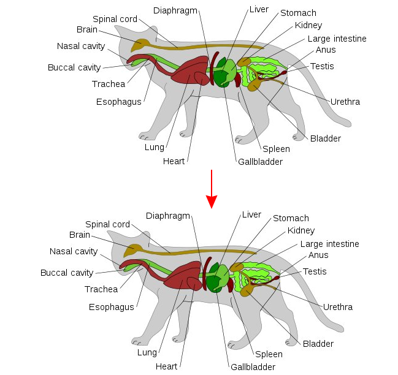
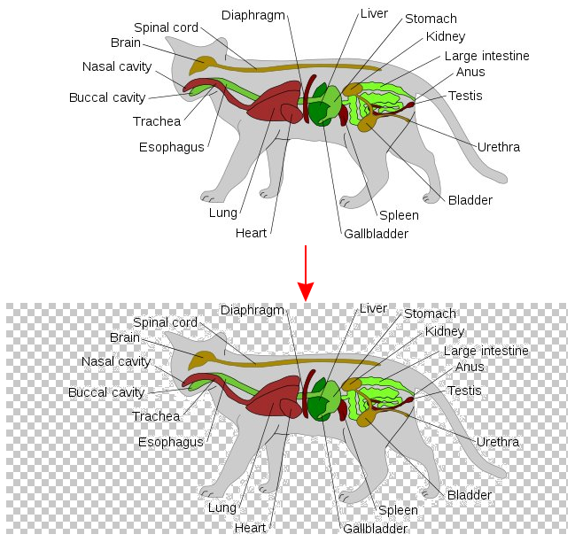
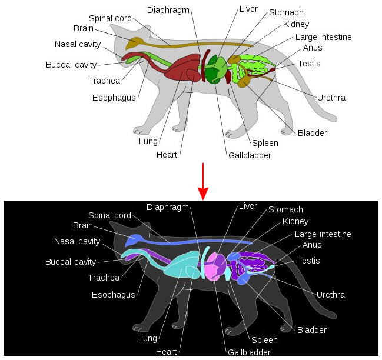

# [dmenu_shot](https://codeberg.org/mehrad/dmenu_shot) Actions

  

## Trim

    

-------
## Remove_white

    

-------
## Negative

    

-------

Author information for [the image used for creating the examples](https://commons.wikimedia.org/wiki/File:Scheme_cat_anatomy.svg):

> By Persian Poet Gal, Surachit, Winstonza, Lord Leatherface, Moheen, Leptictidium, AnonMoos, Chongtin, RuM, Popolon, Uwe Gille, Wyvernoid, Kikos, Hisagi, LambdaCorp, Tux the penguin, Patrol110, 2(L.L.K.)2, Мелкијадес, Homo lupus, Erikire, Jcfidy, Angelito7, Kandar, Router, Lord Leatherface, Whidou, CC BY-SA 3.0, https://commons.wikimedia.org/w/index.php?curid=39183625
